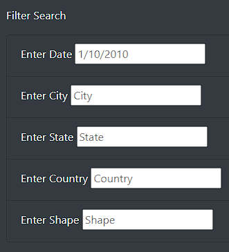
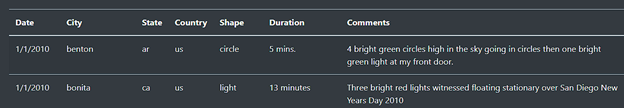

# UFOs Module 11 of UofT Data Analytics bootcamp

# Overview of Project
## Purpose

The purpose is to design a webpage using javascript to take in search criteria and return a result table from the data provided. The javascript is to be designed to search and display in a tabular format data from a source file in json format. The webpage is about UFOs so an appropriate theme is to be applied to webpage for visual appeal. 

# Results

The webpage is designed to search the data and return a table matching the search criteria. As pictured below the sidebar contains the fields where the search criteria could be entered. Any one of the search criteria date, city, state, country, shape or a combination thereof can be used to generate a result table. The format for the various criteria is seen in the example table shown below.

Figure Sidebar for search criteria

Figure Top of result table example

# Summary

The webpage is designed to provide basic search functions for the data. A major drawback is that it cannot handle search criteria in a different format than in the table. A recommendation for further development would be to use regular expressions to validate search criteria and convert into formats compatible with the data. Another recommendation would be to provide a legend to the various columns of the table as in the current design requires some knowledge of the raw data to provide valid search criteria